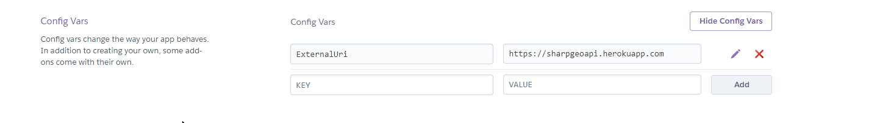

# SharpGeoApi

OGC compliant Server providing an API to geospatial data 

Live demo: https://sharpgeoapi.herokuapp.com/

[](https://github.com/bertt/SharpGeoApi/actions)

Spec: http://docs.opengeospatial.org/is/17-069r3/17-069r3.html

## Milestones

First milestone: serve local GeoJSON files 

Second milestone: Add GDAL/OGR backend for more formats 

## Docker 

Image on Docker hub: https://cloud.docker.com/u/bertt/repository/docker/bertt/sharpgeoapi

Running image:

```
$ docker run -it -p 5000:80 bertt/sharpgeoapi 
```

And point the browser to http://localhost:5000/

Building image: 

```
$ cd src/SharpGeoApi
$ docker build -f ./sharpgeoapi/dockerfile -t bertt/sharpgeoapi .
```

## Developing

Developing in Visual Studio Code:

```
$ git clone https://github.com/bertt/SharpGeoApi.git
$ cd SharpGeoApi
$ code .
```

In VSCode press run/debug and browser opens at https://localhost:5001/

## Continous deployment

There is a Github Actions workflow defined in [aspnetcore.yml](.github/workflows/aspnetcore.yml). On Git push
this workflow does the following:

- Checkout code

- Build code

- Publish Docker image (https://cloud.docker.com/u/bertt/repository/docker/bertt/sharpgeoapi)

- Deploys to Heroku (https://sharpgeoapi.herokuapp.com/)

## Configuration

For service configuration a yaml file is used, by default sample_config.yml.

Configuration values can be overriden by setting environment values. Example of setting ExternalUri setting
in Heroku:



Using this method, all outgoing links to resources are prefixed with root url 'https://sharpgeoapi.herokuapp.com'.

## Content negotiation

Default response content-type is application/json. Mediatype text/html is supported in querystring using the f=html parameter or in the request header (accept: text/html).

For constructing the HTML pages the Razor View Engine is used.

## Sample api requests:

/ : Returns root page

/openapi: returns OpenApi spec (todo)

/conformance: returns conformance doc

/processes: returns processes 

/collections: returns all collections (todo)

/collections/{name}: return collection with id = name (todo)

/collections/{name}/items: return items of collection with id = name (todo)
